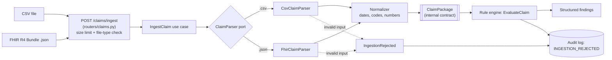

# Data flow: ingestion and normalization

## Diagram

## Steps

1. **Upload.** The client sends a `.csv` or a FHIR Bundle `.json` to `POST /claims/ingest`. Files over 5 MB are refused (413) and other types are refused (415).
2. **Parser selection.** The router picks the adapter by file type. The use case only knows the `ClaimParser` port, so a new format means a new adapter and no other change.
3. **Parsing.** CSV rows are grouped by `claim_id`. For FHIR, references such as `Patient/P001` are resolved inside the bundle.
4. **Normalization.** Dates become ISO 8601, codes are trimmed and uppercased, amounts become numbers, and gender becomes F/M/O/U.
5. **Output.** One `ClaimPackage` per claim: patient, encounter, coverage, provider, diagnoses, claim lines, and `ingestion_warnings`.

## Missing vs. invalid data

| Case | Behavior |
|---|---|
| Optional value missing (e.g. authorization) | Accepted, recorded in `ingestion_warnings`, never guessed |
| Required value missing, wrong type, dangling reference, inconsistent lines | Rejected with `IngestionRejected` (reason, field path, claim id) |
| Invalid JSON, non-Bundle, binary file | Rejected, never a server error |

Missing data is kept visible because rules need it to flag absent information.

## Contract

`apps/api/app/domain/claim_package.py` is the only interface between ingestion and the rule, audit and UI components.